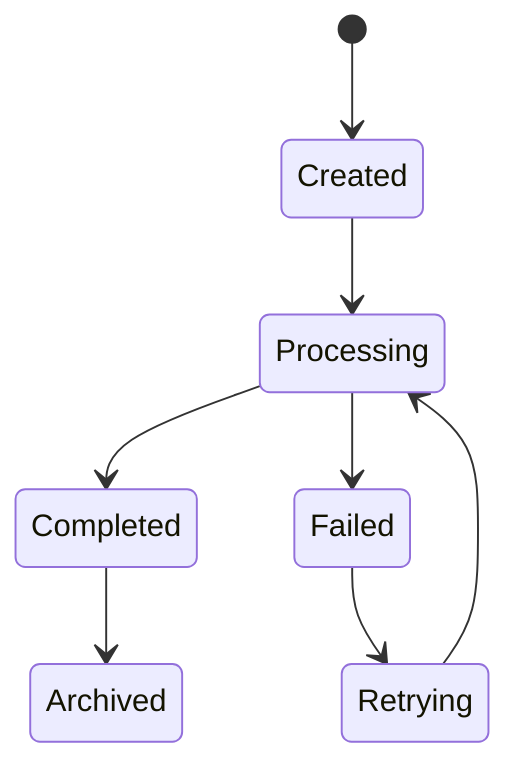
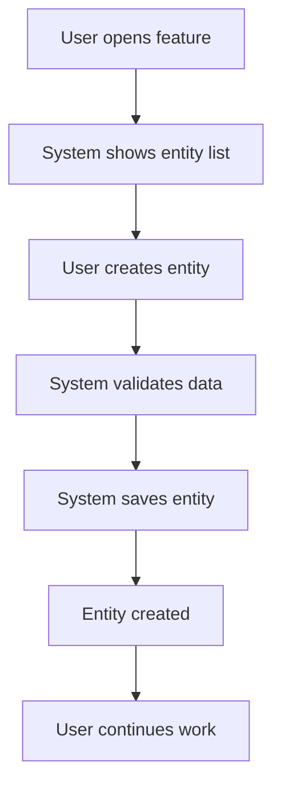
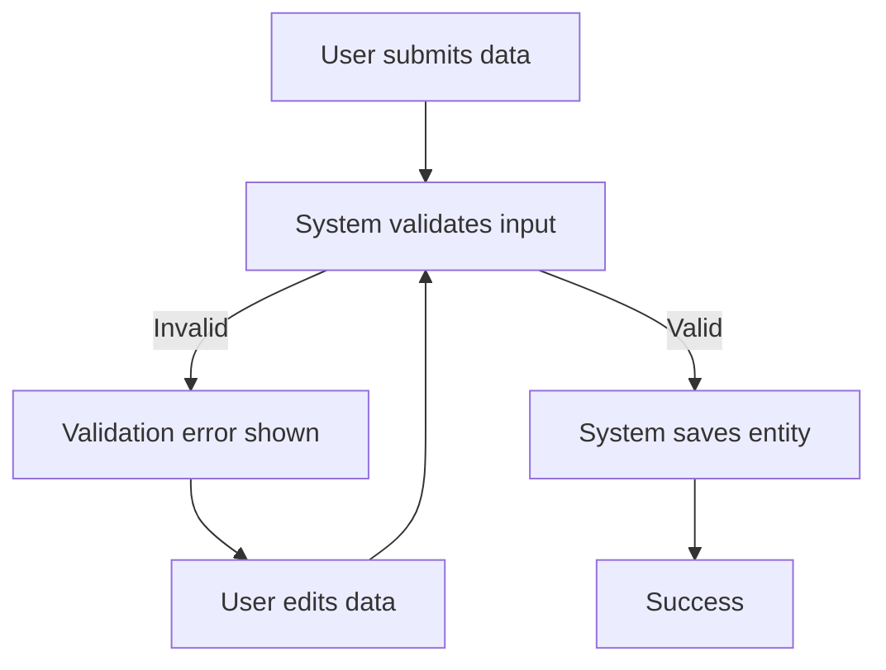
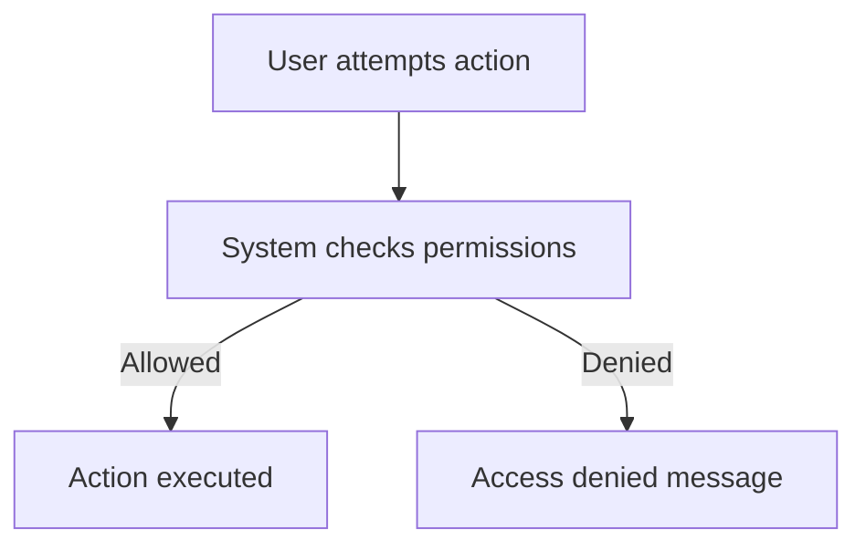
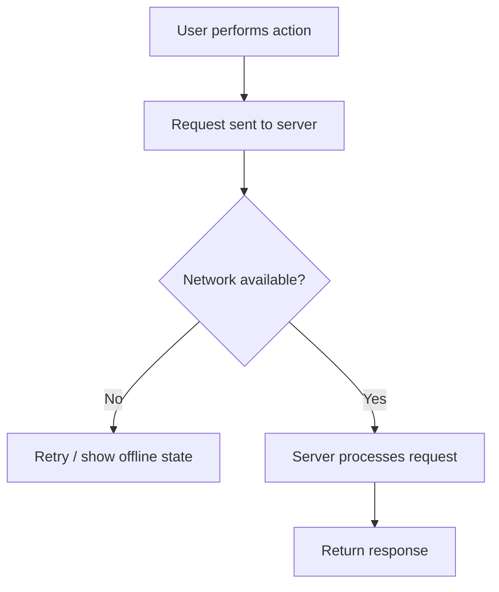

# Feature State

## Instructions

You are now executing this skill.
Use the conversation context and previous analysis results as input.
Immediately perform the workflow described below using the user's request.

Do not invent new entities.
Use Actors, Entities and Interaction Flows from the previous step.

Goal: define lifecycle, flows and edge cases of the main entity.

Tasks:
1. Identify the main entity
2. Define 4–6 lifecycle states
3. Define transitions
4. Define trigger events
5. Identify edge cases
6. Describe UI implication proposals (we have sandbox without backend, no API needed)
7. Generate diagrams

Output:

## Main Entity
...

## States
- ...

## Transitions
- ...

## Trigger Events
- ...

## Edge Cases
- validation error
- permission denied
- network failure
- concurrent update
- empty state
- unexpected system error

## UI Implications
- ...

---

## State Diagram

---

## Happy Path User Flow

---

## Error Flow

---

## Permission Flow

---

## Edge Case Flow

Everything in russian should be in Markdown file with name related to task.

END_WORKFLOW