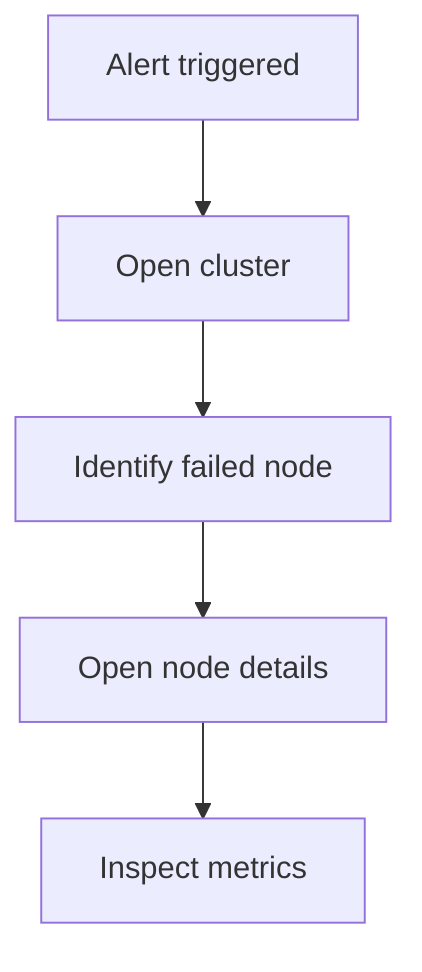

# Skill Failure Scenario

## Execution

You are now executing this skill.

Use the previously defined context, entities, and user flows.

Immediately generate failure scenarios relevant to the system.

Focus on **operator experience and system behavior**, not internal implementation.

---

# Purpose

This skill identifies **failure scenarios** that affect the system.

The goal is to understand:

- how failures appear in the system
- how operators detect them
- how the interface should support investigation
- what information must be visible

This helps designers create interfaces that support **incident response**.

After this stage the analysis continues with **skill-state-model**.

---

# Typical Failures in Infrastructure Systems

Examples:

- node failure
- service crash
- network partition
- replication lag
- split-brain cluster
- disk full
- metrics unavailable
- alert storm
- degraded cluster

---

# Workflow

Follow these steps.

---

## 1. Identify Critical Failure Types

Select **3–5 realistic failures** relevant to the system.

Example:

- node down
- replication lag
- cluster degraded
- metrics unavailable

---

## 2. Describe What Happens

Explain what technically occurs in the system.

Example:

Node failure

A database node stops responding due to hardware or service crash.

---

## 3. Describe What the Operator Sees

Focus on **UI signals**.

Example:

Operator sees:

- node status becomes red
- alert triggered
- cluster health degraded

---

## 4. Describe Investigation Flow

Explain what the operator does next.

Example:

Operator actions:

1. Open cluster view  
2. Identify failing node  
3. Open node metrics  
4. Check replication status  

---

## 5. Identify Required UI Elements

List what the interface must show.

Example:

Required UI elements:

- node health status
- alert severity
- replication lag metric
- event timeline

---

# Output Structure

For each failure scenario use this format.

---

Failure Scenario

Name

What Happened

What Operator Sees

Operator Investigation

Required UI Support

---

# Example

Failure Scenario

Node Failure

What Happened

A cluster node stops responding due to a service crash.

What Operator Sees

- node status becomes red  
- alert appears  
- cluster status becomes degraded  

Operator Investigation

1. Open cluster overview  
2. Identify failing node  
3. Open node details  
4. Inspect system metrics  

Required UI Support

- node status indicator  
- alert panel  
- node metrics  
- event timeline  

---

# Mermaid Incident Flow

Provide a small Mermaid diagram showing the investigation flow.

Use short labels.

Example:

## Important

After this stage the analysis continues with **skill-state-model**.