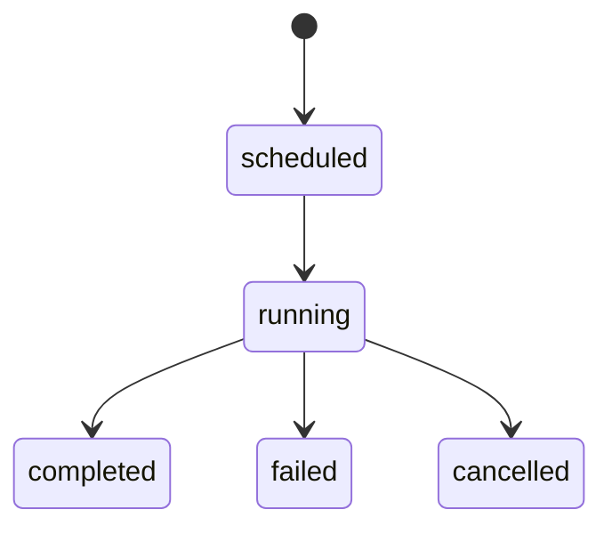

# Skill State Model

## Execution

You are now executing this skill.
Use the previously defined entities, flows, and failure scenarios.
Immediately generate the state model for the feature.

Response in russian.

Focus on **system states and transitions**, not UI layout.

---

# Purpose

This skill defines **state models** for the system objects or operations involved in the feature.

State models help designers understand:

* how the system behaves over time
* what transitions can occur
* what statuses must be visible in the UI
* what operations are possible in each state

State models are useful for:

* monitoring resources
* managing infrastructure
* long-running operations
* background jobs
* maintenance workflows

---

# Types of State Models

Depending on the feature, the state model may describe:

### Resource States

Example:

Node
Bucket
Cluster
Database

Example states:

* healthy
* degraded
* down
* maintenance

---

### Operation States

Example:

Backup
Restore
Migration
Scaling

Example states:

* scheduled
* running
* completed
* failed
* cancelled

---

### Task States

Example:

Scan job
CVE check
Maintenance job

Example states:

* pending
* running
* paused
* finished
* error

---

# Workflow

Follow these steps.

---

## 1. Select the Relevant Entity

Choose the main entity or operation.

Example:

Backup Job
Cluster Node
Storage Bucket

---

## 2. Define States

List **4–6 meaningful states**.

Example:

Backup Job states

* scheduled
* running
* completed
* failed
* cancelled

---

## 3. Define State Transitions

Describe how states change.

Example:

scheduled → running
running → completed
running → failed
running → cancelled

---

## 4. Identify Triggering Events

Explain what causes the transition.

Example:

running → failed

trigger:

* disk full
* network error
* timeout

---

## 5. Identify UI Implications

Explain what the interface must show.

Example:

UI should display:

* current job state
* progress
* failure reason
* timestamps

---

# Output Structure

Provide the following sections.

Entity or Operation

States

State Transitions

Triggering Events

UI Implications

---

# Mermaid State Diagram

Provide a Mermaid state diagram representing the state model.

Use this format:

Keep diagrams simple and readable.

---

# Example

Entity

Backup Job

States

scheduled
running
completed
failed
cancelled

State Transitions

scheduled → running
running → completed
running → failed
running → cancelled

Triggering Events

running → failed

* storage unavailable
* network error

UI Implications

* show job status
* show progress
* show error reason

---

# Analysis Context

state_models:

---

# Next Stage

Continue with:

**skill-data-requirements**

This stage identifies the data and metrics required to support the feature.
