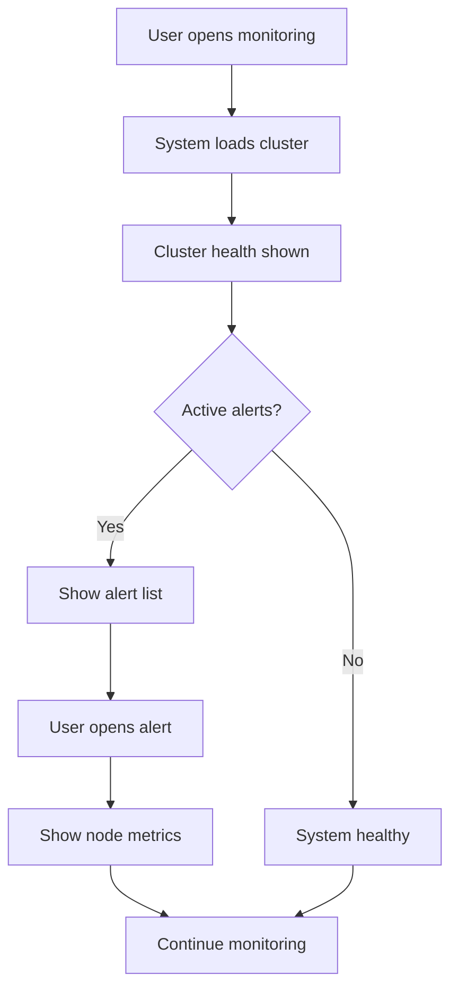

# Skill User Flow

## Execution

You are now executing this skill.
Use the conversation context and previous analysis results as input.
Immediately apply this skill to the user's request using the previously defined entities and system context.

Do not wait for confirmation.
Produce the structured output defined below.

## Important

No todo lists generation. Prevent todo list generation! NO TODO.

---

# Purpose

This skill constructs **user interaction flows** for the feature being analyzed.

The flows describe how users interact with system entities during real operational scenarios.

These flows are used later to:

- design UX screens
- understand operator workflows
- detect missing system states
- identify failure points

This skill focuses on **user actions and system responses**, not visual interface design.

After this stage, the analysis continues with **skill-failure-scenario**.

---

# Domain Context

Typical systems include:

- infrastructure monitoring
- cluster management
- PostgreSQL / Patroni
- AI compute nodes
- storage buckets
- CVE monitoring
- observability systems
- geo-distributed clusters

Typical users:

- DevOps engineers
- SRE
- operators
- platform engineers

Workflows often happen during:

- monitoring
- incidents
- investigation
- maintenance
- configuration

---

# Workflow

Follow these steps.

---

## 1. Identify Main User Goals

Determine the main operational goals for the feature.

Examples:

- monitor cluster health
- investigate incident
- check node status
- respond to alert
- trigger failover
- inspect metrics

---

## 2. Identify Entry Points

Determine where the workflow starts.

Examples:

- cluster list
- alert notification
- incident dashboard
- node detail page
- monitoring overview

---

## 3. Build the Primary User Flow

Create a **step-by-step interaction flow**.

Example structure:

1. User opens monitoring dashboard  
2. User selects cluster  
3. System displays cluster health summary  
4. User detects alert  
5. User opens node details  
6. User investigates metrics  

---

## 4. Define System Reactions

For key steps describe system responses.

Example:

System displays:

- node status
- replication lag
- leader node
- active alerts

---

## 5. Identify Alternative Flows

Add alternative operational paths.

Examples:

- alert triggered
- node failure
- investigation mode
- manual control action

---

# Output Structure

Always produce the following sections.

Goal

Primary User Flow

Alternative Flows

System Responses

---

# Mermaid Flow Diagram

Generate a Mermaid **flowchart** representing the **primary operational user flow**.

The diagram must show:

* user actions
* system responses
* decision points (when relevant)

Keep the diagram compact and readable.

---

## Diagram Rules

Follow these rules strictly:

* Maximum **8–10 nodes**
* Use **short phrases (2–5 words)**
* Avoid full sentences
* Prefer **user → system → decision** pattern
* One main decision per branch
* The flow must be readable **top-to-bottom**

---

## Node Conventions

User actions:

```
[User opens dashboard]
```

System responses:

```
[System loads cluster data]
```

Decision points:

```
{Active alerts?}
```

---

## Mermaid Format

Use this structure:



---

## Diagram Goals

The diagram must clearly show:

* how the user **starts interaction**
* how the system **responds**
* where **decisions or alerts** occur
* how the flow **continues or resolves**

The diagram should represent **real operational workflows** typical for DevOps/SRE systems.

Important: After this stage, the analysis continues with **skill-failure-scenario**.