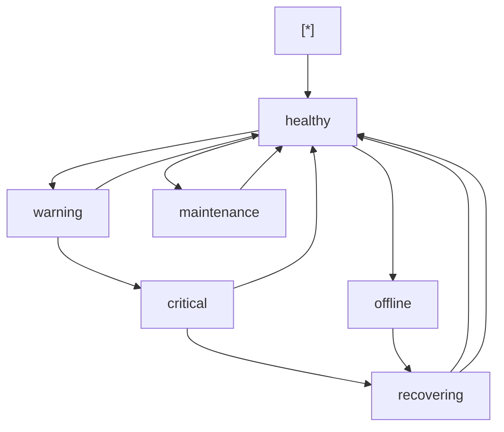
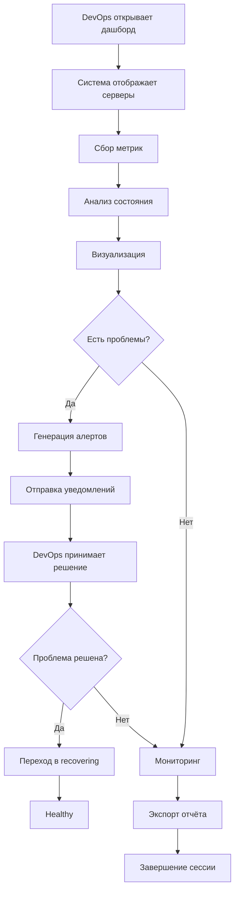
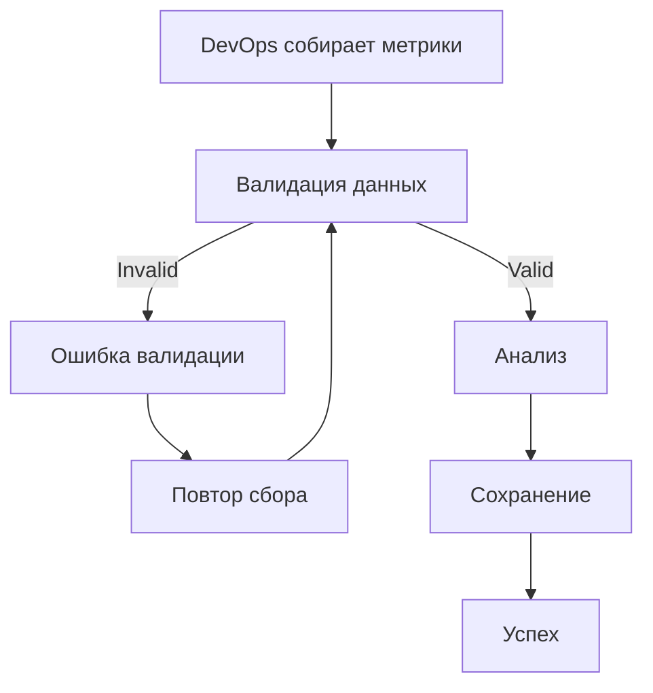
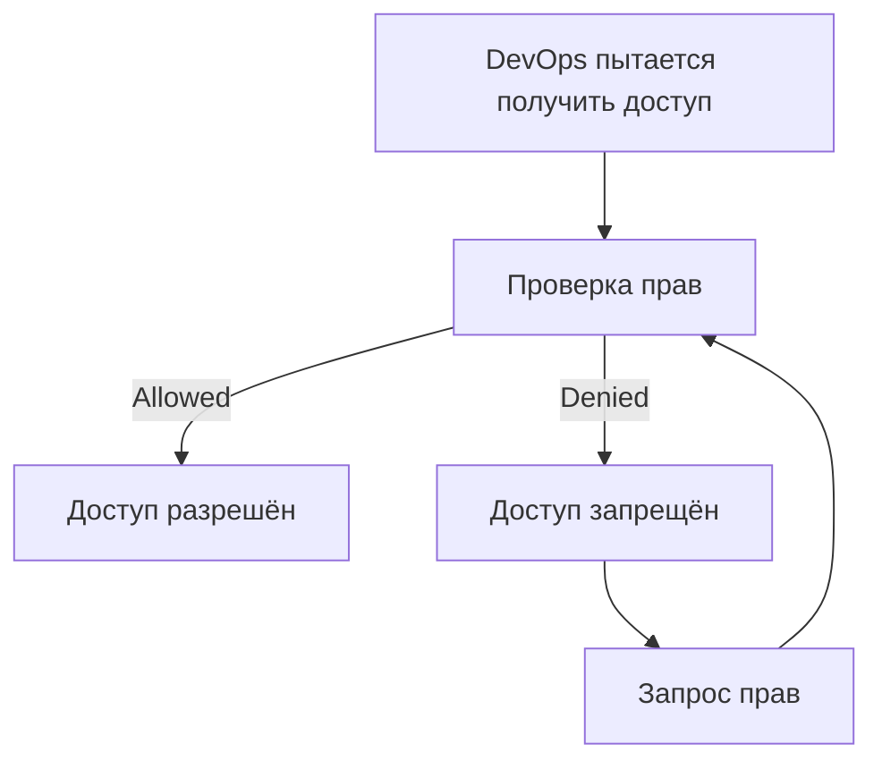
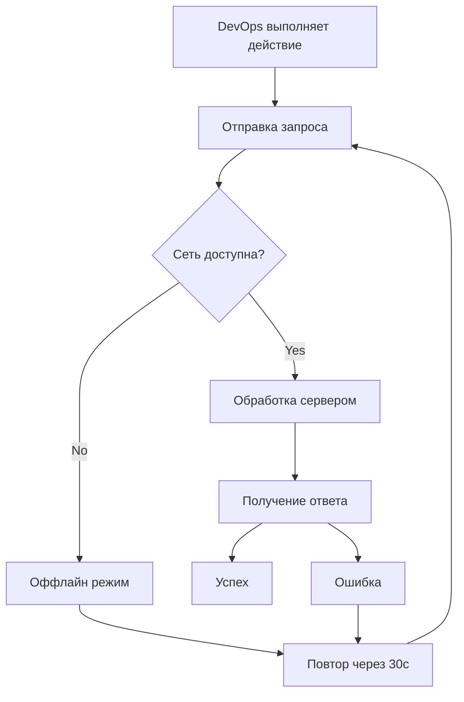

# Модель здоровья ПАК — Жизненный цикл

## Main Entity
**Server** (Сервер) — физический или виртуальный сервер, подлежащий мониторингу здоровья

## States
- **healthy** — сервер работает нормально, все компоненты в порядке
- **warning** — обнаружены незначительные проблемы, требующие внимания
- **critical** — критические проблемы, требующие немедленного вмешательства
- **offline** — сервер недоступен
- **recovering** — сервер восстанавливается после проблем
- **maintenance** — сервер в режиме обслуживания

## Transitions
- **healthy → warning**: метрика превышает порог предупреждения
- **warning → critical**: метрика превышает критический порог
- **critical → recovering**: проблема устранена, метрика возвращается в норму
- **warning → healthy**: метрика возвращается в норму
- **critical → healthy**: проблема устранена полностью
- **any → offline**: сервер теряет связь
- **offline → recovering**: сервер возвращается в сеть
- **recovering → healthy**: сервер полностью восстановлен
- **any → maintenance**: сервер переводится в режим обслуживания
- **maintenance → healthy**: сервер возвращён в эксплуатацию

## Trigger Events
- **metricThresholdExceeded** — метрика превысила порог
- **connectionLost** — потеря связи с сервером
- **connectionRestored** — связь восстановлена
- **problemResolved** — проблема устранена
- **manualTransition** — ручное изменение состояния оператором
- **scheduledMaintenance** — плановое обслуживание

## Edge Cases
- **validation error** — ошибка валидации метрик (некорректный формат данных)
- **permission denied** — отсутствие прав на доступ к серверу
- **network failure** — потеря связи с сервером при сборе метрик
- **concurrent update** — конфликт при одновременном обновлении состояния
- **empty state** — отсутствие данных о сервере
- **unexpected system error** — внутренняя ошибка системы мониторинга

## UI Implications
- **Цветовое кодирование**:
  - healthy: зелёный
  - warning: жёлтый
  - critical: красный
  - offline: серый
  - recovering: оранжевый
  - maintenance: синий
- **Индикаторы состояния**:
  - Иконка статуса рядом с именем сервера
  - Цветная полоса состояния в заголовке
  - Анимация перехода между состояниями
- **Алерты**:
  - Критические алерты — всплывающие уведомления
  - Предупреждения — уведомления в панели
- **История состояний**:
  - Таймлайн изменений состояния
  - Причинно-следственные связи переходов
- **Обработка ошибок**:
  - Валидация — показ ошибки с подсказкой
  - Permission denied — кнопка "Запросить доступ"
  - Network failure — индикатор оффлайн с кнопкой "Повторить"
  - Concurrent update — предупреждение о конфликте
  - Empty state — кнопка "Добавить сервер"
  - System error — кнопка "Обновить"

## State Diagram

## Happy Path User Flow

## Error Flow

## Permission Flow

## Edge Case Flow

## Данные для реализации

### Компоненты UI
- `ServerStatusCard` — карточка статуса сервера
- `HealthMetricsPanel` — панель метрик здоровья
- `AlertPanel` — панель алертов
- `StatusTimeline` — таймлайн состояний
- `HealthDashboard` — главный дашборд

### API эндпоинты
- `GET /api/servers` — список серверов со статусами
- `GET /api/servers/{id}/metrics` — метрики сервера
- `GET /api/servers/{id}/history` — история метрик
- `POST /api/servers/{id}/alerts` — создание алерта
- `GET /api/alerts` — список активных алертов

### Пороги по умолчанию
- CPU: warning > 70%, critical > 90%
- Memory: warning > 75%, critical > 95%
- Disk: warning > 80%, critical > 95%
- Network: warning > 100 Mbps, critical > 500 Mbps
